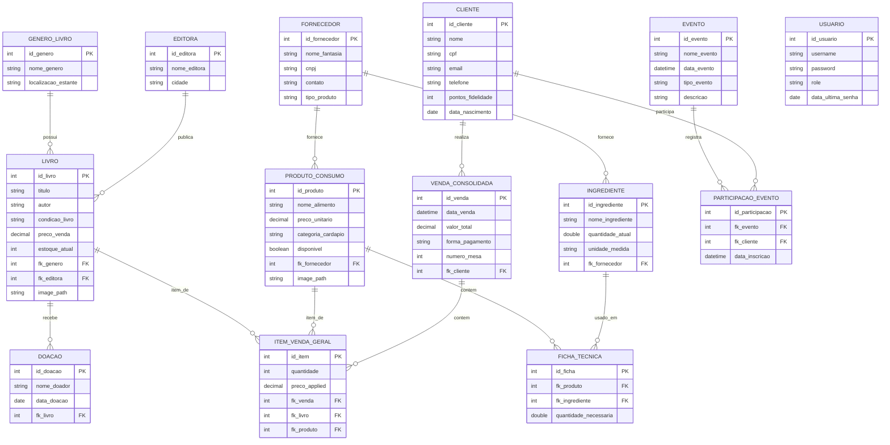

# ☕📚 Coffee & Books ERP - Sistema Integrado de Gestão

O **Coffee & Books** é um sistema ERP de gestão comercial e cultural de nível acadêmico e profissional, desenvolvido em Java com uma interface Swing moderna (FlatLaf Sepia). Ele atende de forma integrada às demandas de uma cafeteria contemporânea (gestão de mesas, comandas, insumos fracionados e controle financeiro) e de um sebo literário (gestão de acervo de livros novos/usados, doações, editoras e eventos culturais).

O projeto atende de forma estrita e exata a todos os critérios de avaliação de Programação Orientada a Objetos (POO) e Bancos de Dados, utilizando design patterns como MVC (Model-View-Controller) e DAO (Data Access Object), tratamento de exceções customizadas, coleções dinâmicas em memória e banco de dados relacional.

---

## 🛠️ Tecnologias e Dependências

- **Linguagem:** Java 17
- **Interface Gráfica (GUI):** Java Swing com look-and-feel **FlatLaf Modern Sepia** v3.4.1 (bordas arredondadas, tema escuro/sepia e componentes reativos)
- **Gerenciador de Dependências:** Maven (`pom.xml`)
- **Banco de Dados:** MySQL / MariaDB (Driver `mysql-connector-j` e `mariadb-java-client`)
- **Execução Automática:** `exec-maven-plugin` para execução do projeto via terminal

---

## 📊 Diagrama Entidade-Relacionamento (DER)

A modelagem do banco de dados relacional `coffeebooks_db` é robusta, composta por 12 tabelas interligadas por chaves estrangeiras com suporte transacional ACID:



---

## 🧭 Módulos do ERP

O Coffee & Books é estruturado em módulos operacionais específicos:

### 1. Acesso e Segurança (RBAC)
- **Telas:** `LoginFrame.java`, `ProfileFrame.java`, `ChangePasswordFrame.java`
- **Funcionalidades:** Login com verificação de perfil de usuário (Administrador e Operador). Se o usuário for administrador, módulos financeiros e de importação são liberados; caso contrário, ficam bloqueados.
- **Segurança:** O sistema migra automaticamente as senhas em texto puro para hashes criptográficos **SHA-256** no primeiro login e rastreia o envelhecimento da senha (expiração a cada 90 dias).

### 2. Acervo Literário (Sebo)
- **Telas:** `LivroForm.java`, `GeneroForm.java`, `ConsultaAcervoFrame.java`
- **Funcionalidades:** Cadastro completo de livros (CRUD) associados a um gênero literário através de um ComboBox dinâmico carregado do banco. Suporte a carregamento de imagens de capa de livros.
- **Consulta Avançada:** Grade filtrada em tempo real por título, autor, condição (Novos/Usados) e faixa de preço. Alertas visuais coloridos nas linhas da tabela para estoque baixo (menos de 3 unidades - amarelo) e crítico (esgotado - vermelho).

### 3. Editoras & Doações
- **Telas:** Acessíveis através dos menus e persistência via `EditoraDAO.java` e `DoacaoDAO.java`
- **Funcionalidades:** Gerenciamento das editoras parceiras do sebo e controle de doações de livros recebidas de clientes, permitindo catalogação ágil e entrada no estoque geral de usados.

### 4. Cafeteria (Cardápio e Insumos)
- **Telas:** `ProdutoConsumoForm.java`, `IngredienteForm.java`
- **Funcionalidades:** Cadastro de alimentos e bebidas com categoria do cardápio e imagens. Controle de estoque fracionado em gramas (g) ou mililitros (ml) de insumos base (como grãos de café, leite e chocolate), permitindo a auditoria de consumo.

### 5. Fornecedores
- **Persistência:** `FornecedorDAO.java`
- **Funcionalidades:** Registro de fornecedores de insumos da cafeteria e fornecedores de livros novos, mantendo dados de CNPJ, contato e o tipo de produto fornecido.

### 6. Eventos Culturais
- **Telas:** `EventoFrame.java`
- **Funcionalidades:** Agenda de atividades e saraus literários, workshops de barismo e feiras de troca de livros.

### 7. Salão, Reservas e Comandas
- **Telas:** `ReservaForm.java`, `ComandaFrame.java`, `ListaEsperaFrame.java`
- **Lista de Espera (Coleção em RAM):** Cadastro dinâmico mantido 100% em memória utilizando `ArrayList<Map<String, String>>`, permitindo busca, adição, alteração de status e ordenação por prioridade sem persistência no banco.
- **Reservas e Comandas:** Mapa de controle de mesas e poltronas. A reserva de um espaço gera uma comanda de consumo vinculada em background.

### 8. Ponto de Venda (PDV)
- **Telas:** `PDVFrame.java`
- **Funcionalidades:** Caixa aberto para fechamento de comandas. Lê itens vinculados ao salão, calcula o subtotal e adiciona pontuação de fidelidade (CPF) baseada nas regras: +5 pontos por livro e +2 pontos por item de cafeteria consumido.
- **Regras de Negócio CRM:** Exibe alerta automático e concede brinde físico (Café Espresso + Marca-páginas) caso o CPF do cliente selecionado pertença a um aniversariante do mês corrente.

### 9. Dashboard Financeiro Executivo
- **Telas:** `FinancialDashboardFrame.java`
- **Funcionalidades:** Análise visual baseada em gráficos desenhados dinamicamente em Java 2D:
  - Faturamento total segmentado por método de pagamento (Pix, Cartão de Crédito/Débito, Dinheiro).
  - Curva de evolução de faturamento dos últimos 12 dias.
  - Exportação de auditoria em arquivo `.txt` contendo relatórios financeiros consolidados.

### 10. Central de Importação CSV
- **Telas:** `ImportacaoDadosFrame.java`
- **Funcionalidades:** Importação em lote de livros, clientes e cardápio a partir de arquivos `.csv`. Executa validação de colunas estruturais, corrige inconsistências menores de dados automaticamente e exibe um terminal de log interativo com barra de progresso.

---

## 🚨 Regras de Negócio & Tratamento de Exceções

O sistema trata falhas comuns de preenchimento e implementa regras de negócio estritas através de exceções personalizadas (pacote `exception`):

1. **`PrecoInvalidoSeboException`**: Impede que livros usados/desgastados custem mais que R$ 50,00 (regra ética do sebo).
2. **`EstoqueInsuficienteException`**: Bloqueia a conclusão de vendas no PDV caso a quantidade comprada exceda o saldo do estoque físico.
3. **`MesaJaOcupadaException`**: Impede reservas duplicadas de mesas ou poltronas no mesmo intervalo de horário.
4. **`UsuarioNaoAutorizadoException`**: Bloqueia o acesso de operadores sem cargo "ADMIN" a relatórios financeiros e importação de dados.
5. **`CampoObrigatorioException`**: Impede o salvamento de cadastros caso campos obrigatórios (como CPF em Clientes ou Título em Livros) não estejam preenchidos.
6. **`ConexaoBancoException`**: Captura falhas de conexão de infraestrutura MySQL e exibe alertas explicativos ao usuário.

---

## 🛡️ Inicialização Auto-Recuperável (Self-Healing)

O Coffee & Books implementa uma lógica de boot altamente resiliente na classe `DatabaseUtil`:
- **Auto-criação:** Ao iniciar o sistema pela primeira vez, se o banco MySQL estiver vazio, as tabelas são criadas automaticamente lendo o arquivo `database.sql` embutido nos recursos.
- **Migração de Schema:** Se tabelas mais recentes (como `CLIENTE` ou `INGREDIENTE`) não existirem, o sistema as cria de forma transparente sem apagar os dados existentes.
- **Massa de Testes (Seed):** Popula o banco com clientes fictícios (incluindo aniversariantes do mês atual para testar o alerta de brinde), livros, produtos de cardápio, fornecedores e transações financeiras dos últimos 12 dias.
- **Segurança de Senhas:** Hasheia de forma transparente todas as senhas antigas em texto puro do banco para **SHA-256** no primeiro boot.

---

## 🚀 Como Executar

### Pré-requisitos
1. Java Development Kit (JDK) 17 instalado e configurado nas variáveis de ambiente.
2. Servidor MySQL/MariaDB ativo na porta padrão (`3306`), sem senha para o usuário `root` (caso possua senha, ajuste os campos correspondentes na classe `util.Banco` ou `util.DatabaseUtil`).

### Execução no Windows
Basta dar um duplo clique no arquivo **`start_coffeebooks.bat`** na raiz do projeto. Ele executará os seguintes passos automaticamente:
1. Detectará o compilador Maven.
2. Compilará o projeto (`mvn clean compile`).
3. Iniciará a tela de login (`view.LoginFrame`).

### Execução via Terminal
Caso prefira o console:
```bash
mvn clean compile
mvn exec:java -Dexec.mainClass="view.LoginFrame"
```

### Dados de Acesso Padrão
- **Administrador:** username: `admin` | password: `admin123` *(O sistema detectará que a senha está expirada por segurança e solicitará alteração imediata no primeiro login!)*
- **Operador:** username: `operador` | password: `op123`

---
*Desenvolvido como projeto integrador para a disciplina de Programação Orientada a Objetos (POO). Entrega Final: Maio/2026.*
