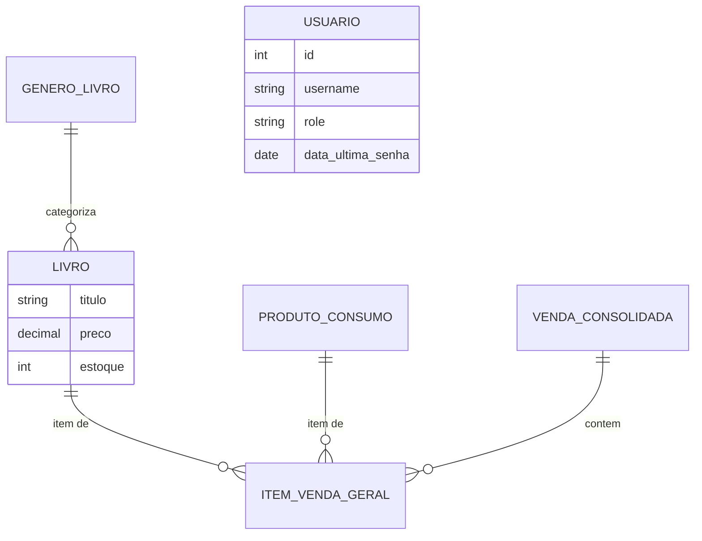

# Coffee&Books - Sistema de Cafeteria e Sebo

Sistema desenvolvido em Java Swing para gestão integrada de uma cafeteria e sebo.

## Estrutura do Projeto
- `src/model`: Classes de entidade.
- `src/view`: Telas JFrame e JDialog.
- `src/exception`: Exceções customizadas.
- `src/util`: Utilitários de banco de dados e constantes visuais.
- `sql/database.sql`: Script de criação do banco de dados MySQL/PostgreSQL.

## Diagrama do Banco de Dados (ER)

## Funcionalidades
1. **Cadastro de Gêneros**: Gestão de seções do sebo com localização física.
2. **Cadastro de Livros**: Inclusão de livros com carregamento dinâmico de gêneros e validação de preço para livros usados.
3. **Reservas (Memória)**: Controle temporário de mesas e poltronas para leitura.
4. **Consulta Avançada**: Busca filtrada por título, autor, condição e preço máximo, exibindo a localização exata na estante.

## Regras de Negócio & Tratamento de Exceções
- **PrecoInvalidoSeboException**: Regra ética: livros desgastados não podem exceder R$ 50,00.
- **EstoqueInsuficienteException**: Impede a venda de obras que não constam no saldo físico do sebo.
- **MesaJaOcupadaException**: Validação de integridade no mapa de mesas do café.
- **UsuarioNaoAutorizadoException**: Controle granular de acesso a módulos administrativos (RBAC).
- **CampoObrigatorioException**: Garante a consistência dos dados nos formulários de cadastro.
- **ConexaoBancoException**: Tratamento amigável para falhas de infraestrutura e rede.

## Como Executar
1. **Banco de Dados**: Execute o script `sql/database.sql` no seu MySQL.
2. **Atalho Rápido**: No Windows, basta dar dois cliques no arquivo **`start_coffeebooks.bat`**.
   - O sistema irá compilar e abrir a tela de login automaticamente.
3. **Manual**: Use o comando `mvn clean compile exec:java`.

---
*Desenvolvido para a disciplina de POO - Entrega Final Maio/2026.*
