# ☕📚 Coffee & Books ERP
## Sistema Integrado de Gestão para Cafeteria e Sebo Cultural
### Adequação Completa aos Critérios de Avaliação Acadêmica

Desenvolvido por **Thamires Martins e Barbara Silva**

---

## 👥 Integrantes do Projeto
*   **Barbara Silva**
*   **Thamires Martins**

---

## 🎯 1. O Conceito e a Oportunidade
O **Coffee & Books** une de forma harmônica a apreciação de cafés especiais e a paixão pela leitura literária.

<div class="grid-symmetric">
<div class="card">
<h3>Sebo Literário</h3>

* **Estoque Duplo:** Gestão simultânea de livros físicos (novos e usados) e catálogo literário.
* **Comunidade:** Conexão direta com eventos culturais, clubes de leitura e workshops.
</div>

<div class="card">
<h3>Cafeteria</h3>

* **Espaço Vivo:** Controle em tempo real de ocupação de mesas, poltronas e comandas ativas.
* **Governança:** Fechamentos financeiros ágeis de insumos perecíveis com rigorosa trilha de auditoria.
</div>
</div>

---

## ⚖️ O Desafio do Estoque Duplo
### Duas naturezas operacionais na mesma base relacional

<table style="width:100%; border-collapse:collapse; margin-top:10px; font-size:0.75em; color:#2b211a; background-color:#f5ede3; border-radius:12px; overflow:hidden; border: 1px solid #dcd1c4;">
  <thead>
    <tr style="background-color:#ece0d1; border-bottom:2px solid #dcd1c4; text-align:left;">
      <th style="padding:8px 10px;">Característica</th>
      <th style="padding:8px 10px;">📖 Sebo Literário (Livros)</th>
      <th style="padding:8px 10px;">☕ Cafeteria (F&B)</th>
    </tr>
  </thead>
  <tbody>
    <tr style="border-bottom:1px solid #dcd1c4;">
      <td style="padding:8px 10px; font-weight:bold;">Natureza</td>
      <td style="padding:8px 10px;">Produto Físico / Bem Durável</td>
      <td style="padding:8px 10px;">Insumo Perecível / Fracionado</td>
    </tr>
    <tr style="border-bottom:1px solid #dcd1c4;">
      <td style="padding:8px 10px; font-weight:bold;">Unidade de Medida</td>
      <td style="padding:8px 10px;">Unidade (Un)</td>
      <td style="padding:8px 10px;">Gramas (g) / Mililitros (ml)</td>
    </tr>
    <tr style="border-bottom:1px solid #dcd1c4;">
      <td style="padding:8px 10px; font-weight:bold;">Status Crítico</td>
      <td style="padding:8px 10px;"><span class="badge-dark">Livro Esgotado</span></td>
      <td style="padding:8px 10px;"><span class="badge-red">Insumo Insuficiente</span></td>
    </tr>
    <tr>
      <td style="padding:8px 10px; font-weight:bold;">Regra de Fidelidade</td>
      <td style="padding:8px 10px;">+5 pontos por unidade vendida</td>
      <td style="padding:8px 10px;">+2 pontos por consumo final</td>
    </tr>
  </tbody>
</table>

<div class="alert-box">
  ⚠️ <strong>Nota:</strong> Sistemas genéricos falham ao tratar livros e grãos de café com a mesma lógica de banco de dados.
</div>

---

## 🏗️ 2. Arquitetura e Stack Tecnológica
*   **Interface Gráfica (GUI):** Java Swing com look-and-feel **FlatLaf Modern Sepia**, proporcionando uma estética sepia premium com bordas arredondadas e micro-animações.
*   **Banco de Dados:** MySQL/MariaDB com suporte transacional ACID para auditoria e controle de estoque livre de falhas.
*   **Design Pattern:** MVC (Model-View-Controller) e DAO (Data Access Object) para persistência e separação limpa de conceitos.
*   **Gerenciador de Dependências:** **Maven** configurado para compilação rápida e gerenciamento de bibliotecas.

<div class="grid-symmetric" style="margin-top:15px;">
  <div class="card">
    <h3>Camada Visual</h3>
    <p>Java Swing + FlatLaf Sepia. Interfaces organizadas em Split-Panes responsivos.</p>
  </div>
  <div class="card">
    <h3>Camada de Persistência</h3>
    <p>MySQL ACID gerenciado por DAO. Inicialização resiliente e migration automática.</p>
  </div>
</div>

---

## 📊 3. Checklist de Critérios e Conformidade
Mapeamento exato de cada critério de avaliação da disciplina com a solução em nosso projeto:

<table style="width:100%; border-collapse:collapse; font-size:0.65em; color:#2b211a; background-color:#f5ede3; border-radius:8px; overflow:hidden; border: 1px solid #dcd1c4;">
  <thead>
    <tr style="background-color:#ece0d1; text-align:left;">
      <th style="padding:4px 8px;">Critério de Avaliação</th>
      <th style="padding:4px 8px; text-align:center;">Nota Máx.</th>
      <th style="padding:4px 8px; text-align:center;">Status</th>
      <th style="padding:4px 8px;">Componente / Classe no Projeto</th>
    </tr>
  </thead>
  <tbody>
    <tr style="border-bottom:1px solid #dcd1c4;">
      <td style="padding:4px 8px; font-weight:bold;">Uso do Maven</td>
      <td style="padding:4px 8px; text-align:center;">0,5</td>
      <td style="padding:4px 8px; text-align:center;"><span class="badge">100% OK</span></td>
      <td style="padding:4px 8px;"><code>pom.xml</code> com FlatLaf e MySQL Driver</td>
    </tr>
    <tr style="border-bottom:1px solid #dcd1c4;">
      <td style="padding:4px 8px; font-weight:bold;">Menu Principal</td>
      <td style="padding:4px 8px; text-align:center;">1,0</td>
      <td style="padding:4px 8px; text-align:center;"><span class="badge">100% OK</span></td>
      <td style="padding:4px 8px;"><code>MainFrame.java</code> (Sidebar de Navegação + Dashboard)</td>
    </tr>
    <tr style="border-bottom:1px solid #dcd1c4;">
      <td style="padding:4px 8px; font-weight:bold;">Cad. Banco COM ComboBox</td>
      <td style="padding:4px 8px; text-align:center;">2,0</td>
      <td style="padding:4px 8px; text-align:center;"><span class="badge">100% OK</span></td>
      <td style="padding:4px 8px;"><code>LivroForm.java</code> + <code>LivroDAO</code> (JOIN com Gênero 1:N)</td>
    </tr>
    <tr style="border-bottom:1px solid #dcd1c4;">
      <td style="padding:4px 8px; font-weight:bold;">Cad. Banco SEM ComboBox</td>
      <td style="padding:4px 8px; text-align:center;">1,0</td>
      <td style="padding:4px 8px; text-align:center;"><span class="badge">100% OK</span></td>
      <td style="padding:4px 8px;"><code>ClienteForm.java</code> + <code>ClienteDAO</code> (Entidade Forte)</td>
    </tr>
    <tr style="border-bottom:1px solid #dcd1c4;">
      <td style="padding:4px 8px; font-weight:bold;">Cad. Collections (RAM)</td>
      <td style="padding:4px 8px; text-align:center;">1,5</td>
      <td style="padding:4px 8px; text-align:center;"><span class="badge">100% OK</span></td>
      <td style="padding:4px 8px;"><code>ListaEsperaFrame.java</code> (ArrayList de Maps em RAM)</td>
    </tr>
    <tr style="border-bottom:1px solid #dcd1c4;">
      <td style="padding:4px 8px; font-weight:bold;">Consulta Avançada</td>
      <td style="padding:4px 8px; text-align:center;">1,5</td>
      <td style="padding:4px 8px; text-align:center;"><span class="badge">100% OK</span></td>
      <td style="padding:4px 8px;"><code>ConsultaAcervoFrame.java</code> (Alertas Visuais coloridos)</td>
    </tr>
    <tr style="border-bottom:1px solid #dcd1c4;">
      <td style="padding:4px 8px; font-weight:bold;">Tratamento de Exceção</td>
      <td style="padding:4px 8px; text-align:center;">1,0</td>
      <td style="padding:4px 8px; text-align:center;"><span class="badge">100% OK</span></td>
      <td style="padding:4px 8px;">6 Exceções Customizadas no pacote <code>exception</code></td>
    </tr>
    <tr>
      <td style="padding:4px 8px; font-weight:bold;">Script do Banco</td>
      <td style="padding:4px 8px; text-align:center;">0,5</td>
      <td style="padding:4px 8px; text-align:center;"><span class="badge">100% OK</span></td>
      <td style="padding:4px 8px;"><code>sql/database.sql</code> (12 Tabelas Relacionadas no total)</td>
    </tr>
  </tbody>
</table>

---

## 🧭 4. Menu Principal & Dashboard
### Tela: Menu Principal (`MainFrame.java`)

<div class="grid">
<div>

* **Visual Funcional:** Centraliza o acesso a todos os módulos da aplicação em uma sidebar lateral elegante.
* **Massa Crítica em Tempo Real:** Dashboard apresenta contadores analíticos dinâmicos:
  - Quantidade de livros no acervo.
  - Clientes cadastrados.
  - Produtos do cardápio e faturamento diário.
* **Alerta Dinâmico:** No topo, um banner em vermelho notifica o operador sobre estoque de livros esgotados.
</div>

<div>
  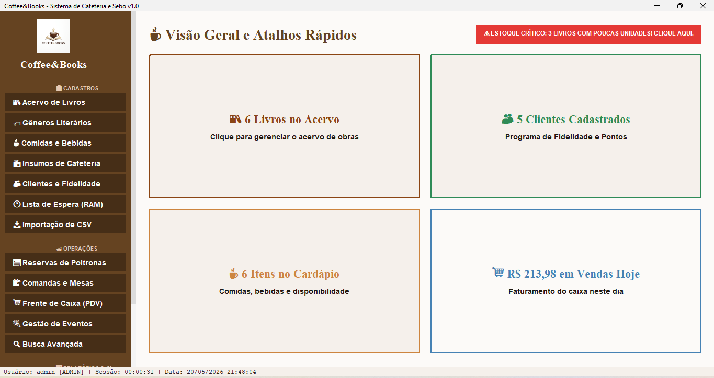
</div>
</div>

---

## 👥 5. Cadastro de Entidade Forte (Sem ComboBox)
### Tela: Cadastro de Clientes (`ClienteForm.java`)

<div class="grid">
<div>

* **Entidade Independente:** Não possui chaves estrangeiras que impeçam a inserção de seus registros iniciais.
* **Campos Desenvolvidos:** ID, Nome, CPF (chave única), E-mail, Telefone e Data de Nascimento.
* **Operações CRUD Completas:** Inclusão, alteração, consulta e exclusão síncrona conectada ao banco MySQL.
* **Fidelidade:** Painel dedicado para operações rápidas de adicionar/subtrair pontos.
</div>

<div>
  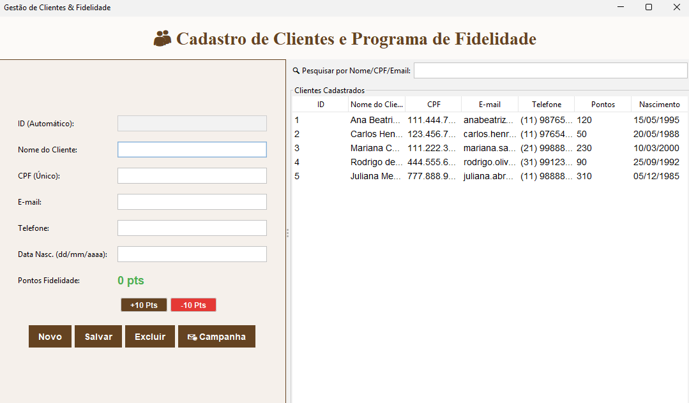
</div>
</div>

---

## 📚 6. Cadastro de Entidade Dependente (Com ComboBox 1:N)
### Tela: Gestão de Acervo (`LivroForm.java`)

<div class="grid">
<div>

* **Relacionamento 1:N:** Cada Livro depende obrigatoriamente de um Gênero Literário.
* **ComboBox Dinâmico:** Carrega os gêneros diretamente da tabela forte de gêneros, impedindo falhas na restrição.
* **Campos:** ID, Título, Autor, Gênero (ComboBox), Condição (ComboBox), Preço de Venda e Estoque (Spinner).
* **Mídia:** Suporte a upload e renderização em tempo real de fotos das capas.
</div>

<div>
  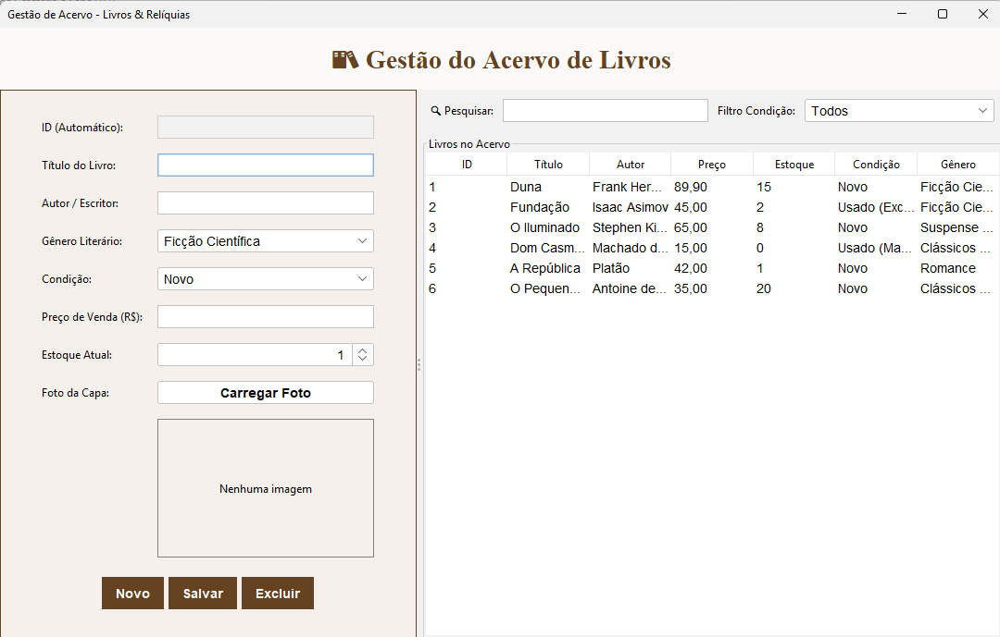
</div>
</div>

---

## 🕐 7. Cadastro Collections (RAM Sem Banco)
### Tela: Fila de Espera do Salão (`ListaEsperaFrame.java`)

<div class="grid">
<div>

* **Persistência Volátil:** Dados residem puramente em memória RAM. Ao fechar a tela, os registros são descartados.
* **Implementação Técnica:** Uso de `ArrayList<Map<String, String>>`. Cada linha no array é representada por um `LinkedHashMap` para reter a ordem exata de preenchimento.
* **Controle Operacional:**
  - Contador integrado que invoca `.size()` na coleção.
  - Botões para chamar próximo (`remove(0)`) e limpar fila.
</div>

<div>
  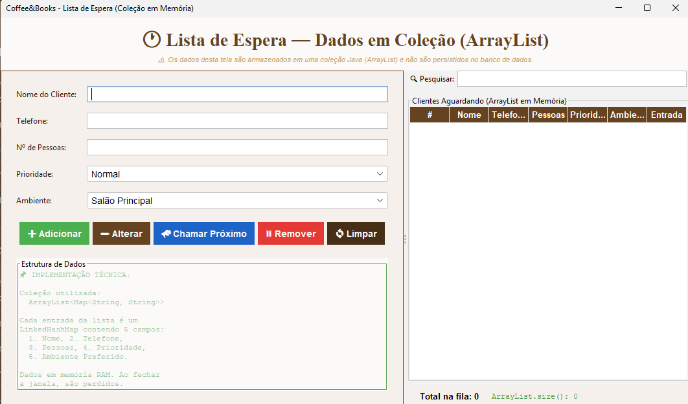
</div>
</div>

---

## 🔍 8. Tela de Consulta Avançada
### Tela: Filtros e Tabela Reativa (`ConsultaAcervoFrame.java`)

<div class="grid">
<div>

* **Filtros Facetados Avançados:** Busca textual instantânea (Título/Autor) combinada com filtro de estado física do livro (Todos, Novo, Usado) e faixa de preço.
* **Alertas Visuais no JTable:**
  - Linhas em <span style="background-color: #ffcdd2; color: #b71c1c; padding: 2px 5px; border-radius: 4px; font-weight: bold;">Vermelho</span>: Estoque Crítico (Esgotado).
  - Linhas em <span style="background-color: #fff9c4; color: #f57f17; padding: 2px 5px; border-radius: 4px; font-weight: bold;">Amarelo</span>: Estoque Baixo (< 3 unidades).
* **Agregação:** Totalizador dinâmico de itens e valor financeiro exibidos no rodapé.
</div>

<div>
  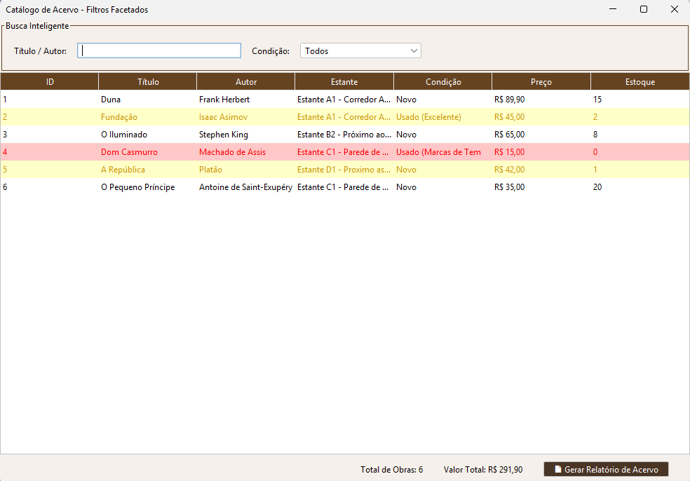
</div>
</div>

---

## 🔑 9. Login e Segurança
### Tela: Autenticação de Usuários (`LoginFrame.java`)

<div class="grid">
<div>

* **Controle Granular (RBAC):** Restringe acesso a rotas do menu lateral conforme a função (ADMIN ou OPERADOR).
* **Criptografia Integrada:** Lógica automatizada no primeiro boot que criptografa senhas em texto puro para hashes **SHA-256** seguros.
* **Expiração Temporal:** Rastreia e bloqueia a sessão se a senha estiver envelhecida (expiração recomendada em 90 dias).
</div>

<div>
  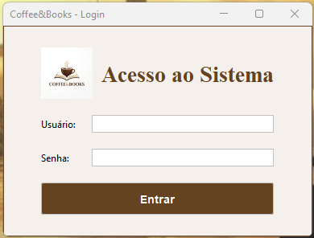
</div>
</div>

---

## 🛋️ 10. Mapa de Salão e Ocupação
### Tela: Monitor de Mesas (`ComandaFrame.java` / `ReservaForm.java`)

<div class="grid">
<div>

* **Controle Visual do Salão:** Grid responsivo que representa a disposição de poltronas e mesas.
* **Cores Indicativas de Status:**
  - <span style="color:#4b8c4f; font-weight:bold;">Verde:</span> Espaço livre para novas ocupações.
  - <span style="color:#a94442; font-weight:bold;">Vermelho:</span> Mesa ocupada com comanda de consumo aberta em background.
* **Normalização de Horários:** Evita erros humanos de digitação na entrada.
</div>

<div>
  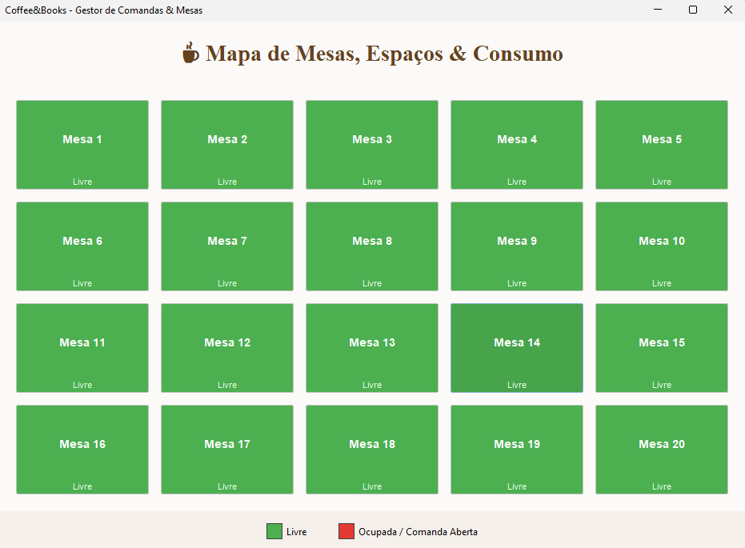
</div>
</div>

---

## 🛒 11. Frente de Caixa (PDV)
### Tela: Checkout e Regras de Negócio (`PDVFrame.java`)

<div class="grid">
<div>

* **Operação Integrada:** Agrupa e fecha comandas vindas do salão ou gera vendas diretas no balcão.
* **Divisão de Cardápio por Abas:** Separação de bebidas, salgados, doces e livros.
* **Automação de Brindes (CRM):** Pop-up e alerta são exibidos automaticamente quando o CPF do cliente selecionado pertence a um aniversariante do mês atual, liberando um Espresso + Marca-páginas.
</div>

<div>
  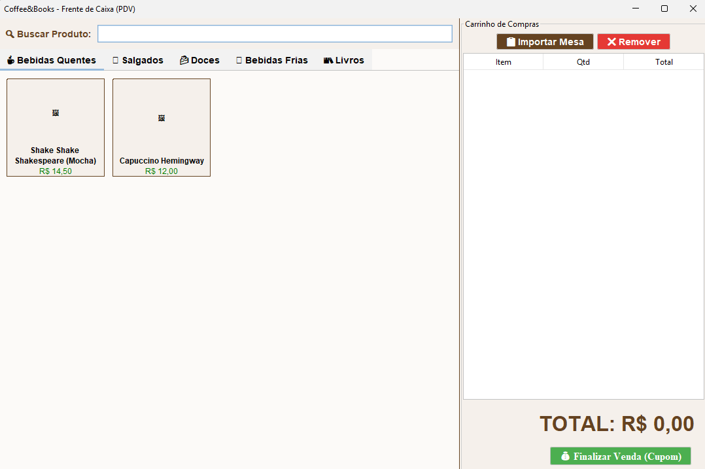
</div>
</div>

---

## 📊 12. Relatórios e Dashboard Financeiro
### Tela: Gráficos Estatísticos (`FinancialDashboardFrame.java`)

<div class="grid">
<div>

* **Gráficos Desenhados Dinamicamente:** Lógica puramente baseada em Java 2D, eliminando dependências de bibliotecas externas complexas:
  - Gráfico de barras com faturamento por método de pagamento.
  - Gráfico de linha com evolução de faturamento semanal.
* **Exportação Gerencial:** Botão integrado para gerar arquivo `.txt` consolidando dados auditados.
</div>

<div>
  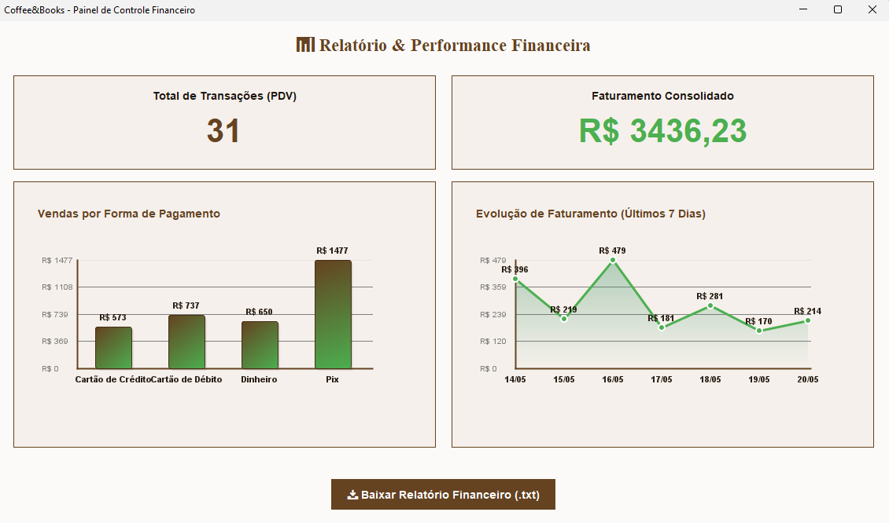
</div>
</div>

---

## 📥 13. Central de Importação CSV
### Tela: Carga de Dados Inicial (`ImportacaoDadosFrame.java`)

<div class="grid">
<div>

* **Carga em Lote:** Importador integrado para Livros, Clientes e Cardápio a partir de arquivos `.csv`.
* **Resiliência a Inconsistências:** Realiza correções automáticas de formatação nos registros lidos.
* **Console de Processamento:** Terminal visual que fornece feedback instantâneo da execução através de logs e barra de progresso.
</div>

<div>
  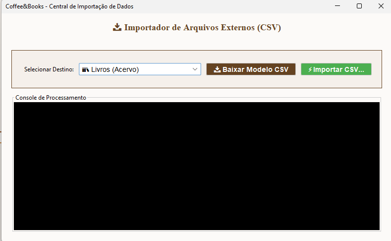
</div>
</div>

---

## 🛡️ 14. Inicialização Auto-Recuperável (Self-Healing)
Implementamos uma camada de resiliência e segurança robusta na inicialização do sistema (`DatabaseUtil`):

*   **Criação Dinâmica de Tabelas:** O sistema detecta a ausência de tabelas essenciais no MySQL/MariaDB e executa o script `database.sql` de forma transparente no primeiro boot.
*   **Migração Transparente de Dados:** Permite a adição de colunas em bancos existentes mantendo registros intactos.
*   **Massa de Testes (Seed):** Popula tabelas com clientes, livros, produtos do cardápio e faturamento dos últimos 12 dias de forma automatizada.

---

## 🚨 15. Tratamento de Exceções Customizadas
Exceções personalizadas no pacote `exception` para consistência e regras de negócio:

1. **`CampoObrigatorioException`**: Garante que campos chave não fiquem vazios.
2. **`PrecoInvalidoSeboException`**: Livros usados desgastados não podem exceder R$ 50,00.
3. **`EstoqueInsuficienteException`**: Impede a conclusão de vendas sem estoque físico.
4. **`MesaJaOcupadaException`**: Valida a integridade do mapa de mesas do café.
5. **`UsuarioNaoAutorizadoException`**: Bloqueia acessos administrativos para operadores normais.
6. **`ConexaoBancoException`**: Captura falhas de conexão de rede de maneira amigável.

---

## 🗂️ 16. Outros Módulos Administrativos
### Gestão de Cardápio, Insumos e Gêneros

<div class="grid-symmetric">
<div class="card" style="text-align: center;">
<h3>Insumos da Cafeteria</h3>
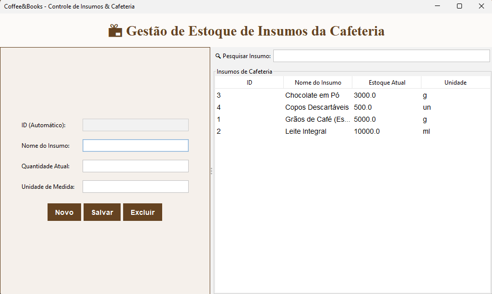
<p style="font-size:0.7em; margin-top:5px;"><code>IngredienteForm.java</code> - Gerencia estoque de leite, grãos e açúcar.</p>
</div>

<div class="card" style="text-align: center;">
<h3>Cardápio (Comidas e Bebidas)</h3>
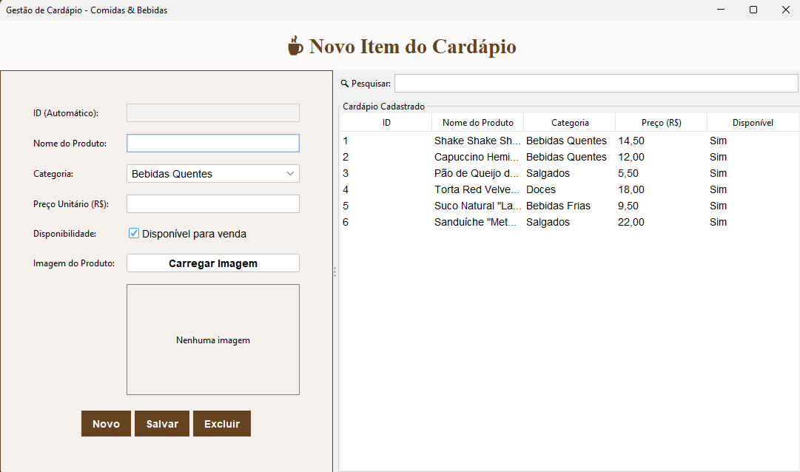
<p style="font-size:0.7em; margin-top:5px;"><code>ProdutoConsumoForm.java</code> - Associa imagens e preços a bebidas e doces.</p>
</div>
</div>

---

## 🛋️ 17. Outras Telas de Operação
### Gestão de Reservas e Planejamento de Eventos

<div class="grid-symmetric">
<div class="card" style="text-align: center;">
<h3>Reservas Ativas de Poltronas</h3>
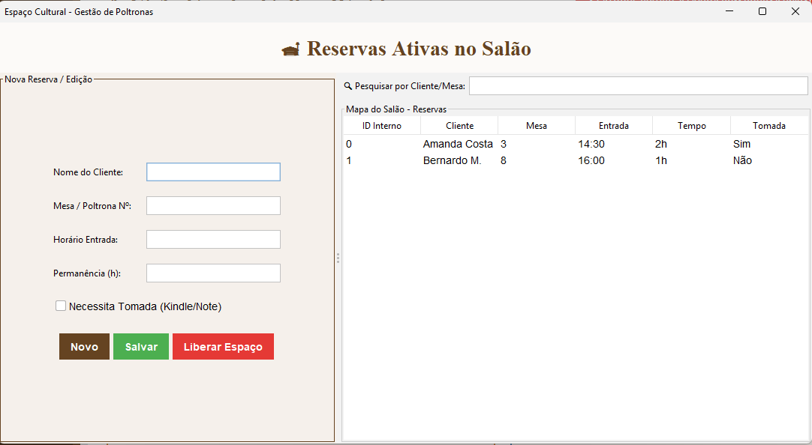
<p style="font-size:0.7em; margin-top:5px;"><code>ReservaForm.java</code> - Mapeamento e liberação de espaços físicos de leitura.</p>
</div>

<div class="card" style="text-align: center;">
<h3>Eventos, Saraus e Oficinas</h3>
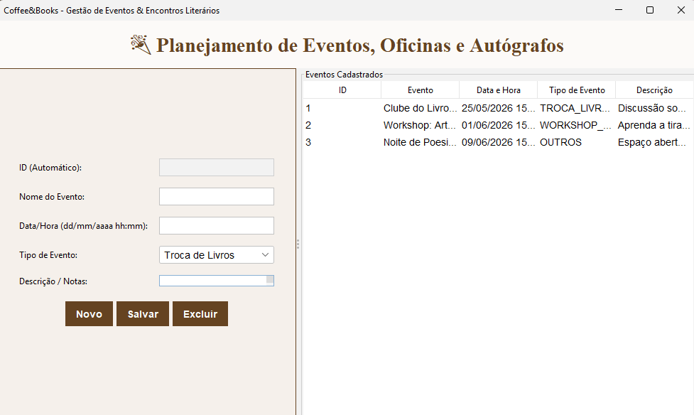
<p style="font-size:0.7em; margin-top:5px;"><code>EventoFrame.java</code> - Organização de atividades culturais integradas.</p>
</div>
</div>

---

## ⚙️ 18. Perfil do Colaborador
### Configurações de Perfil e Preferência de Temas (`ProfileFrame.java`)

<div class="grid">
<div>

* **Preferências do Usuário:** Permite configurar o tema visual do sistema em tempo de execução:
  - **Tema Claro (Sépia):** Visual padrão focado em legibilidade diurna.
  - **Tema Escuro (Café):** Foco em baixo brilho para operações noturnas.
* **Segurança:** Acesso rápido ao diálogo de redefinição e envelhecimento de senhas.
</div>

<div>
  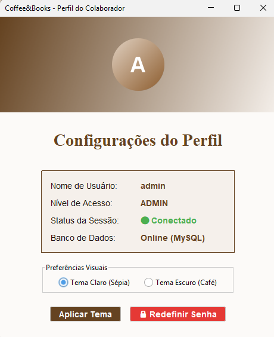
</div>
</div>

---

## 🗄️ 19. Estrutura de Banco de Dados (14 Tabelas)

```sql
-- Principais tabelas mapeadas no script database.sql:
GENERO_LIVRO (id_genero, nome_genero, localizacao_estante)
EDITORA (id_editora, nome_editora, cidade)
FORNECEDOR (id_fornecedor, nome_fantasia, cnpj, contato, tipo_produto)
CLIENTE (id_cliente, nome, cpf, email, telefone, pontos_fidelidade, data_nascimento)
LIVRO (id_livro, titulo, autor, condicao_livro, preco_venda, estoque_atual, fk_genero, fk_editora, image_path)
PRODUTO_CONSUMO (id_produto, nome_alimento, preco_unitario, categoria_cardapio, disponivel, fk_fornecedor, image_path)
INGREDIENTE (id_ingrediente, nome_ingrediente, quantidade_atual, unidade_medida, fk_fornecedor)
VENDA_CONSOLIDADA (id_venda, data_venda, valor_total, forma_pagamento, numero_mesa, fk_cliente)
ITEM_VENDA_GERAL (id_item, quantidade, preco_applied, fk_venda, fk_livro, fk_produto)
DOACAO (id_doacao, nome_doador, data_doacao, fk_livro)
USUARIO (id_usuario, username, password, role, data_ultima_senha)
EVENTO (id_evento, nome_evento, data_evento, tipo_evento, descricao)
FICHA_TECNICA (id_ficha, fk_produto, fk_ingrediente, quantidade_necessaria)
PARTICIPACAO_EVENTO (id_participacao, fk_evento, fk_cliente, data_inscricao)
```

---

## 🗂️ 20. DER - Diagrama de Classes e Entidades

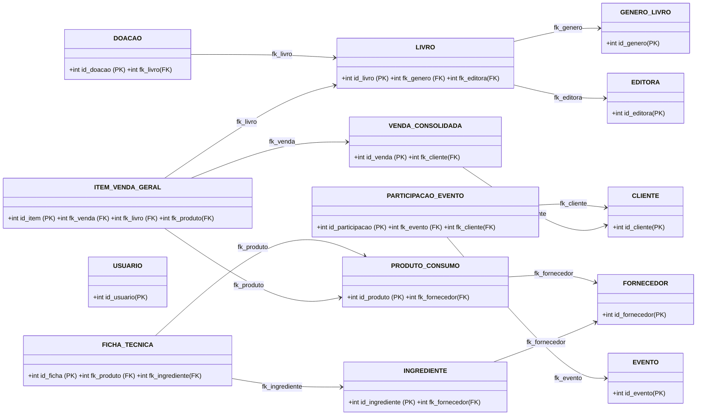

---

## 🚀 21. Próximos Passos
Planejamento de escala operacional do sistema:

<div class="grid-3">
<div class="card">
<h3>Pilar 1: Hardware</h3>

Integração com impressoras térmicas não-fiscais para cupons de venda e comandas de preparo.
</div>

<div class="card">
<h3>Pilar 2: Mobilidade</h3>

Aplicativo mobile para garçons lançarem itens na comanda diretamente da mesa do cliente.
</div>

<div class="card">
<h3>Pilar 3: Digital</h3>

E-commerce integrado ao sebo para venda online de acervo em tempo real.
</div>
</div>

---

## 📈 22. Conclusão e Diferenciais do ERP
O **Coffee & Books ERP** entrega uma plataforma comercialmente viável que atende de ponta a ponta a gestão de um negócio real e preenche todos os requisitos acadêmicos.

### Principais Diferenciais:
1.  **Adesão Estrita aos Critérios:** Soluções claras e documentadas para cada item da grade.
2.  **Design e Usabilidade:** Look-and-feel moderno Sepia, interfaces split-pane, responsivas e fáceis de usar.
3.  **Robustez de Negócio:** Controle rígido de regras de negócio, auditoria financeira e alertas proativos.
4.  **Qualidade de Código:** Padrões MVC e DAO limpos, sem acoplamento e prontos para expansão.
