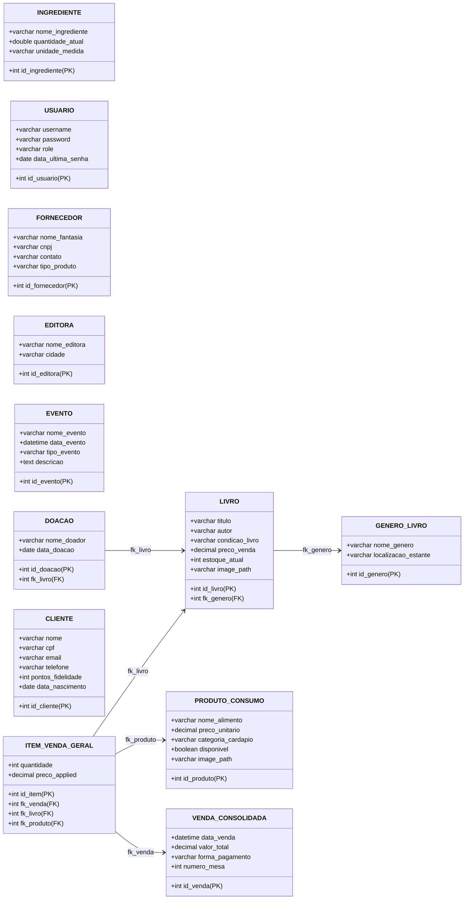

# ☕📚 Coffee & Books ERP
## Sistema Integrado de Gestão para Cafeteria e Sebo Cultural

---

## 👥 Integrantes do Projeto
*   **Thamires Martins**
*   **Barbara Silva**

---

## 🎯 1. O Conceito e a Oportunidade
O **Coffee & Books** é uma proposta inovadora que une dois mercados acolhedores: a apreciação de cafés especiais e a paixão pela leitura (sebo literário). 

### O Desafio de Negócio:
*   Gerenciar o estoque duplo (livros usados/novos e insumos perecíveis).
*   Controlar a ocupação de mesas e espaços de leitura em tempo real.
*   Conectar com o público através de eventos culturais e fidelização.
*   Oferecer fechamentos financeiros rápidos com auditoria.

### A Solução:
Um ERP **robusto, intuitivo, elegante (tema Sepia/Café FlatLaf)** e totalmente integrado de ponta a ponta!

---

## 🏗️ 2. Arquitetura e Stack Tecnológica
*   **Interface Gráfica (GUI):** Java Swing com look-and-feel **FlatLaf Modern Sepia/Dark**, proporcionando uma experiência estética premium, com bordas arredondadas e micro-animações.
*   **Banco de Dados:** MySQL com suporte transacional ACID para auditoria e controle de estoque livre de falhas.
*   **Design Pattern:** MVC (Model-View-Controller) e DAO (Data Access Object) para persistência e separação de conceitos.

---

## 🗂️ 3. Módulos de Cadastro (Telas de Gestão Split-Pane)
Todas as telas seguem o padrão premium **Split-Pane** (Formulário à esquerda, Barra de Busca e Tabela Interativa à direita):

### 📚 1. Cadastro de Acervo (Livros)
*   Cadastro de Título, Autor, Preço, Gênero e Condição (Novo/Usado).
*   Controle de estoque rigoroso.
*   Área dedicada para **Carregamento e Visualização da Imagem da Capa**.

### 🏷️ 2. Cadastro de Gêneros Literários
*   Associação obrigatória para livros.
*   Inclui **Localização Física da Estante** no salão para facilitar o atendimento.

### ☕ 3. Cadastro de Comidas e Bebidas (Cardápio)
*   Itens separados por categorias.
*   Suporte para **Upload de Fotos dos Pratos/Bebidas** e controle de disponibilidade imediata.

### 📦 4. Cadastro de Insumos da Cafeteria (Ingredientes)
*   Controle quantitativo em gramas (g), mililitros (ml) e unidades (un).
*   Itens padrão pré-semeados (Grãos de Café, Leite, Chocolate, Copos).

### 👥 5. Clientes & Painel de Fidelidade
*   Armazena dados cadastrais, e-mail, telefone e **Data de Nascimento** (essencial para surpresas).
*   Visualizador do saldo de **Pontos de Fidelidade** acumulados com controles manuais de ajuste do gerente.

---

## 🛋️ 4. Módulos de Operações (Telas Operacionais)

### 🛋️ 1. Reservas de Poltronas e Mesas
*   Mapeamento visual do salão.
*   **Normalização de Horários Inteligente:** Aceita `12:30`, `12h30` ou `12h`.
*   *Integração:* Ao reservar uma poltrona, uma comanda de consumo é automaticamente aberta em segundo plano para o cliente.

### 📝 2. Mapa de Comandas Ativas (Mesas)
*   Exibição em grade reativa: mesas livres são exibidas em cinza/marrom e ocupadas em vermelho vibrante.
*   Exibe o nome do cliente e consumo acumulado na comanda.
*   Permite que o garçom clique na mesa e adicione itens consumidos do cardápio em tempo real.

### 🛒 3. Frente de Caixa (PDV)
*   Importador automático de comandas de mesa para poupar tempo.
*   Adição e remoção dinâmica de itens no carrinho com busca inteligente.
*   **Múltiplas Formas de Pagamento:** Pix, Crédito, Débito e Dinheiro.
*   **Regra de Aniversário:** Alerta visual instantâneo se for o aniversário do cliente, indicando entrega de brindes (Café Espresso + Marca-páginas cortesia).

### 🔍 4. Busca Avançada de Acervo
*   Central de consulta rápida de livros por autor, título ou gênero.
*   Destaque colorido e visual para obras esgotadas ou com estoque crítico.

### 🎉 5. Gestão de Eventos Culturais
*   CRUD persistido de eventos (Noites de Autógrafos, Workshops de Café, Clube de Leitura).
*   Garante que o calendário cultural da loja esteja sempre atualizado.

---

## 📊 5. Inteligência de Negócio e Relatórios

### 📥 1. Central de Importação de Arquivos CSV
*   Possibilidade de subir dados em lote de **Livros, Clientes ou Cardápios** via planilha CSV.
*   Permite baixar modelos prontos direto na máquina do usuário para formatação correta.
*   Terminal visual com logs em estilo computacional retrô detalhando a transação de carregamento.

### 📬 2. Disparador de Campanhas de Fidelidade (Mês do Aniversário)
*   Filtra automaticamente do banco todos os aniversariantes do mês atual.
*   Permite disparar em lote cupons de cortesia via e-mail simulado com apenas um clique.

### 📊 3. Dashboard Executivo de Finanças
*   Gráficos elegantes side-by-side desenhados nativamente em Java 2D:
    *   **Gráfico de Barras:** Faturamento total agrupado por método de pagamento.
    *   **Gráfico de Tendência (Linha):** Curva contínua de vendas nos últimos 7 dias de faturamento.
*   **Geração e Download de Relatório (.txt):** Exporta um documento gerencial consolidado contendo estatísticas auditadas e o log histórico cronológico de todas as transações da loja.

---

## 🚨 6. Regras de Negócio Implementadas por Trás dos Panos
1.  **Baixa de Estoque Físico:** Vendas de livros no PDV verificam disponibilidade física e impedem furos de estoque.
2.  **Baixa Automática de Receita de Insumos:** Vender café ou doces consome frações de ingredientes no inventário automaticamente (ex: Café Espresso abate 15g de Grãos de Café e 1 Copo Descartável).
3.  **Alerta de Reposição de Estoque Crítico:** Um banner dinâmico é exibido no topo do menu inicial se algum livro cair para <= 2 unidades, linkado diretamente para a busca.
4.  **Pontuação Automática por Unidade:**
    *   Cada **Livro** vendido soma **+5 pontos** ao CPF do cliente.
    *   Cada **Café/Alimento** consumido soma **+2 pontos** ao CPF do cliente.

---

## 🗄️ 7. DER - Diagrama de Entidade-Relacionamento

Abaixo está a modelagem do nosso banco de dados relacional `coffeebooks_db` desenhado via **Mermaid**:

---

## 📈 8. Conclusão e Futuro do ERP
O **Coffee & Books** ERP entrega uma plataforma comercialmente viável que atende de ponta a ponta a gestão de um negócio de cafeteria e sebo cultural. 

### Próximos Passos:
*   Integração física com impressoras térmicas não-fiscais para impressão de cupons e comandas de cozinha.
*   Desenvolvimento de aplicativo móvel para garçons efetuarem pedidos diretamente da mesa via tablet.
*   Criação de um e-commerce integrado de sebo de livros conectado em tempo real com o estoque físico do ERP.
