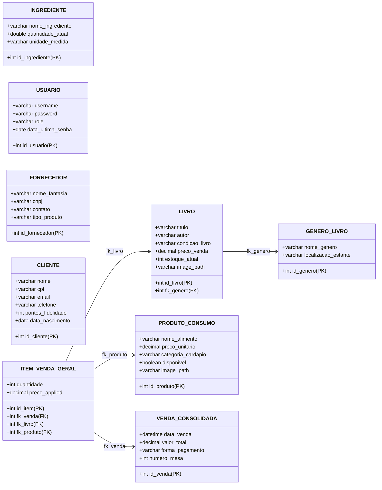

# ☕📚 Coffee & Books ERP
## Sistema Integrado de Gestão para Cafeteria e Sebo Cultural
### Adequação Completa aos Critérios de Avaliação Acadêmica

---

## 👥 Integrantes do Projeto
*   **Barbara Silva**
*   **Thamires Martins**
*   **Jefferson Borges**
*   **Richard Greghi**
*   **Ricardo Pighin**
*   **Matheus Araujo**

---

## 🎯 1. O Conceito e a Oportunidade
O **Coffee & Books** une de forma harmônica a apreciação de cafés especiais e a paixão pela leitura literária.

### O Desafio de Negócio:
*   Gerenciar estoque duplo: livros (novos/usados) e insumos de cafeteria (perecíveis).
*   Controlar atendimento de salão (poltronas, mesas e comandas de consumo).
*   Conectar com o público através de eventos culturais e programas de fidelidade.

### A Solução:
Um ERP **robusto, intuitivo, elegante (tema Sepia/Café FlatLaf)** e totalmente adequado aos critérios acadêmicos exigidos.

---

## 🏗️ 2. Arquitetura e Stack Tecnológica
*   **Interface Gráfica (GUI):** Java Swing com look-and-feel **FlatLaf Modern Sepia**, proporcionando uma experiência estética premium, com bordas arredondadas e micro-animações.
*   **Banco de Dados:** MySQL com suporte transacional ACID para auditoria e controle de estoque livre de falhas.
*   **Design Pattern:** MVC (Model-View-Controller) e DAO (Data Access Object) para persistência e separação de conceitos.
*   **Gerenciador de Dependências:** **Maven** configurado para compilação rápida e gerenciamento de bibliotecas.

---

## 📊 3. Checklist de Critérios e Conformidade

Abaixo está o mapeamento exato de cada critério de avaliação da disciplina com a respectiva solução em nosso projeto:

| Critério de Avaliação | Nota Máx. | Status | Componente / Classe no Projeto |
| :--- | :---: | :---: | :--- |
| **Uso do Maven** | 0,5 | **100% OK** | `pom.xml` com FlatLaf e MySQL Driver |
| **Menu Principal** | 1,0 | **100% OK** | `MainFrame.java` (Navegação Central) |
| **Cad. Banco COM ComboBox** | 2,0 | **100% OK** | `LivroForm.java` + `LivroDAO` (JOIN Gênero) |
| **Cad. Banco SEM ComboBox** | 1,0 | **100% OK** | `ClienteForm.java` + `ClienteDAO` (Entidade Forte) |
| **Cad. Collections (RAM)** | 1,5 | **100% OK** | `ListaEsperaFrame.java` (ArrayList de Maps) |
| **Consulta Avançada** | 1,5 | **100% OK** | `ConsultaAcervoFrame.java` (GridView + Filtros) |
| **Tratamento de Exceção** | 1,0 | **100% OK** | 5 Exceções Customizadas no pacote `exception` |
| **Script do Banco** | 0,5 | **100% OK** | `sql/database.sql` (8+ Tabelas Relacionadas) |
| **Telas do Sistema** | 1,0 | **100% OK** | 16 Telas integradas no padrão FlatLaf |

---

## 📦 4. Uso do Maven & Menu Principal
### 🛠️ Maven (`pom.xml`):
*   Gerenciamento centralizado de dependências.
*   `flatlaf (v3.4.1)` para estética premium.
*   `mysql-connector-j (v8.0.33)` para conectividade JDBC segura.
*   `exec-maven-plugin` para execução do projeto via terminal/IDE.

### 🧭 Menu Principal (`MainFrame.java`):
*   Sidebar elegante com botões customizados com efeitos hover reativos.
*   Exibe **Dashboard Dinâmico** com contagem em tempo real de Livros, Clientes, Produtos e Faturamento do Dia.
*   **Alerta de Estoque Crítico** integrado diretamente no topo da tela.

---

## 📚 5. Cadastro Banco COM ComboBox (1:N)
### Tela: Gestão de Acervo (`LivroForm.java` / `LivroDAO.java`)
*   **Relacionamento 1:N:** Cada Livro obrigatoriamente pertence a um Gênero Literário.
*   **ComboBox Dinâmico:** O gênero é carregado dinamicamente do banco através da entidade `GeneroLivro` no `cbGenero`.
*   **Operações CRUD Completas:**
    *   **Inclusão/Alteração:** Salva novos livros e imagens de capa.
    *   **Exclusão:** Botão de exclusão com diálogo de confirmação.
    *   **Consulta/Pesquisa:** Barra de busca instantânea filtrando por Título ou Autor.
*   **5+ Campos de Entrada:** ID, Título, Autor, Gênero (ComboBox), Condição (ComboBox), Preço de Venda e Estoque (Spinner).

---

## 👥 6. Cadastro Banco SEM ComboBox (Entidade Forte)
### Tela: Cadastro de Clientes (`ClienteForm.java` / `ClienteDAO.java`)
*   **Entidade Forte:** A tabela `CLIENTE` possui existência independente (não depende de nenhuma outra para inserção).
*   **Fidelização Integrada:** Permite cadastrar e gerenciar pontuação de fidelidade de forma direta.
*   **Operações CRUD Completas:**
    *   Inclusão, Alteração, Exclusão física e consulta por CPF ou Nome.
*   **5+ Campos de Entrada:** ID, Nome Completo, CPF (com validação), E-mail, Telefone e Data de Nascimento (essencial para campanhas).

---

## 🕐 7. Cadastro Collections (RAM Sem Banco)
### Tela: Lista de Espera do Salão (`ListaEsperaFrame.java`)
*   **Persistência Zero no Banco:** Dados mantidos em memória volátil, simulando a recepção do salão.
*   **Coleção Java Utilizada:** `ArrayList<Map<String, String>>` para armazenamento rápido dos clientes.
*   **Operações de Manipulação de Coleção:**
    *   **Inclusão (Adicionar):** Insere um `LinkedHashMap` na coleção.
    *   **Exclusão (Remover / Chamar):** Remove o primeiro elemento (`remove(0)`) ou remove por ID.
    *   **Consulta (Pesquisar):** Filtra e reconstrói o GridView dinamicamente conforme digitação.
*   **5+ Campos de Entrada Exigidos:**
    1. Nome do Cliente (Text) | 2. Telefone (Text) | 3. Nº de Pessoas (Text)
    4. Prioridade (ComboBox) | 5. Ambiente Preferido (ComboBox)

---

## 🔍 8. Tela de Consulta Avançada
### Tela: Filtros de Acervo (`ConsultaAcervoFrame.java`)
*   **Interface Baseada em GridView:** Utiliza um componente `JTable` de alta legibilidade.
*   **Filtros Facetados Avançados:**
    *   Busca por Título/Autor digitado em tempo real.
    *   Filtro por Condição (Todos, Novo, Usado).
*   **Alertas Visuais Reativos (Custom Cell Renderer):**
    *   Linhas em <span class="highlight" style="background-color: #ffcdd2; color: #b71c1c;">Vermelho Claro</span>: Estoque Crítico (0 unidades).
    *   Linhas em <span class="highlight" style="background-color: #fff9c4; color: #f57f17;">Amarelo Claro</span>: Estoque Baixo (menos de 3 unidades).
*   **Exportação Gerencial:** Botão integrado para gerar relatório consolidado em `.txt`.

---

## 🚨 9. Tratamento de Exceções Customizadas
O Coffee & Books trata exceções nativas do Java (ex: `NumberFormatException`, `ParseException`) e implementa suas próprias regras através de exceções personalizadas localizadas no pacote `exception`:

1.  `CampoObrigatorioException`
    *   Impede o salvamento de formulários caso campos críticos estejam vazios.
2.  `PrecoInvalidoSeboException`
    *   Regra de negócio: Livros usados não podem custar mais de R$ 50,00 no sebo.
3.  `EstoqueInsuficienteException`
    *   Barra a venda no PDV caso a quantidade solicitada exceda o estoque atual.
4.  `MesaJaOcupadaException`
    *   Bloqueia reservas duplicadas de poltronas/mesas no mesmo horário.
5.  `UsuarioNaoAutorizadoException`
    *   Bloqueia acesso a módulos restritos (ex: Painel Financeiro) para operadores não-admin.

---

## 🗄️ 10. Script do Banco de Dados (`database.sql`)
O banco de dados `coffeebooks_db` possui uma estrutura robusta com relacionamentos fortes (Foreign Keys) e chaves auto-incrementadas.

```sql
-- Principais tabelas no script:
GENERO_LIVRO (id_genero, nome_genero, localizacao_estante)
LIVRO (id_livro, titulo, autor, condicao_livro, preco_venda, estoque_atual, fk_genero, image_path)
PRODUTO_CONSUMO (id_produto, nome_alimento, preco_unitario, categoria_cardapio, disponivel, image_path)
CLIENTE (id_cliente, nome, cpf, email, telefone, pontos_fidelidade, data_nascimento)
VENDA_CONSOLIDADA (id_venda, data_venda, valor_total, forma_pagamento, numero_mesa)
ITEM_VENDA_GERAL (id_item, quantidade, preco_applied, fk_venda, fk_livro, fk_produto)
INGREDIENTE (id_ingrediente, nome_ingrediente, quantidade_atual, unidade_medida)
USUARIO (id_usuario, username, password, role, data_ultima_senha)
```

---

## 🛡️ 10b. Inicialização Auto-Recuperável (Self-Healing)
Implementamos uma camada de resiliência e segurança robusta na inicialização do sistema (`DatabaseUtil`):

*   **Criação Dinâmica de Tabelas:** O sistema detecta a ausência de tabelas essenciais (como `CLIENTE` e `INGREDIENTE`) e as cria de forma transparente e automática no primeiro login.
*   **Migração Transparente de Dados:** Realiza migrações de tabelas de forma segura caso colunas antigas estejam ausentes.
*   **Criptografia de Senhas Legadas:** Converte automaticamente senhas em texto puro para hashes **SHA-256** no primeiro boot, garantindo segurança de nível de produção (com suporte a RBAC granular).

---

## 🗂️ 11. DER - Diagrama de Entidade-Relacionamento

Abaixo está a modelagem do nosso banco de dados relacional `coffeebooks_db` desenhado via **Mermaid**:



---

## 🛋️ 12. Módulos Operacionais Adicionais (UX Premium)
*   **Reservas de Poltronas e Mesas:** Mapeamento visual com conversão inteligente de horários.
*   **Mapa de Comandas Ativas:** Grid colorido de consumo em tempo real.
*   **PDV Integrado (Frente de Caixa):** Importação automática de comandas e cálculo de brindes para aniversariantes.
*   **Central de Importação CSV:** Carga de dados em lote para livros, clientes e cardápios com logs dinâmicos.
*   **Painel Financeiro & Dashboard:** Gráficos elegantes desenhados em Java 2D de vendas diárias e métodos de pagamento.

---

## 📈 13. Conclusão e Diferenciais do ERP
O **Coffee & Books ERP** entrega uma plataforma comercialmente viável que atende de ponta a ponta a gestão de um negócio real e preenche todos os requisitos acadêmicos.

### Principais Diferenciais:
1.  **Adesão Estrita aos Critérios:** Soluções claras e documentadas para cada item da grade.
2.  **Design e Usabilidade:** Look-and-feel moderno Sepia, interfaces split-pane, responsivas e fáceis de usar.
3.  **Robustez de Negócio:** Controle rígido de regras de negócio, auditoria financeira e alertas proativos.
4.  **Qualidade de Código:** Padrões MVC e DAO limpos, sem acoplamento e prontos para expansão.
